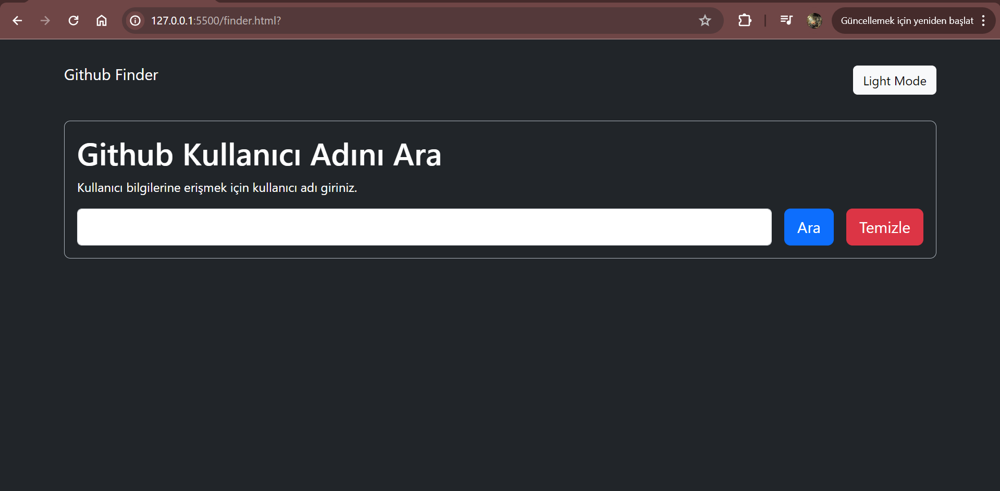

#  Github Finder
The GitHub Finder project is a web application built using HTML, CSS, and JavaScript that allows users to search for GitHub profiles and display detailed information about each user. It interacts with the GitHub API to fetch data such as repositories, followers, following, and other profile details. The user interface is designed to be simple and responsive, providing an intuitive experience for users.

# Used Technologies

- HTML for structure.
- CSS for styling and layout.
- JavaScript for dynamic content and interactivity.

# Preview

# GIF
